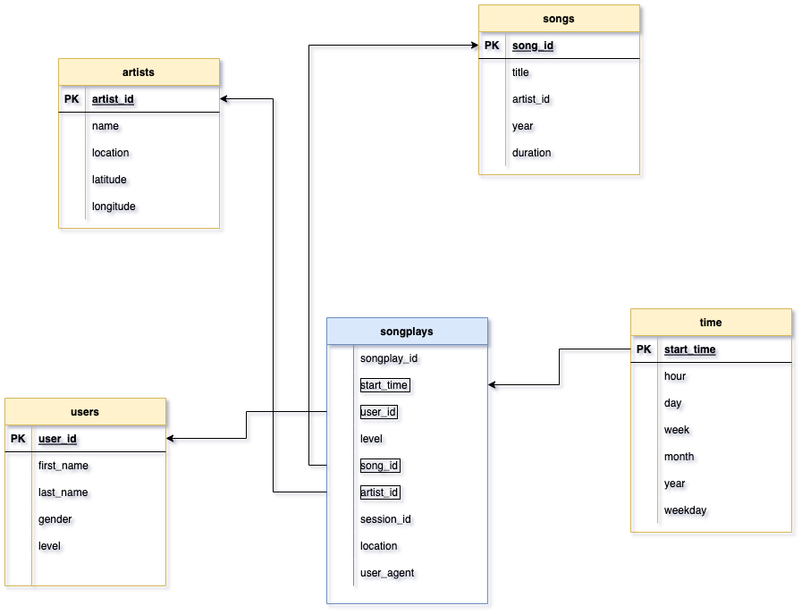

# Project: Data Modeling with Postgres

###### Udacity Data Engineer Nanodegree
___

### Introduction
A startup called Sparkify wants to analyze the data they've been collecting on songs and user activity on their new music streaming app. The analytics team is particularly interested in understanding what songs users are listening to. Currently, they don't have an easy way to query their data, which resides in a directory of JSON logs on user activity on the app, as well as a directory with JSON metadata on the songs in their app.

They'd like a data engineer to create a Postgres database with tables designed to optimize queries on song play analysis, and bring you on the project. Your role is to create a database schema and ETL pipeline for this analysis. You'll be able to test your database and ETL pipeline by running queries given to you by the analytics team from Sparkify and compare your results with their expected results.

### Project Process
1) Define fact and dimension tables for a star schema for a particular analytic focus
2) Build an ETL pipeline that transfers data from files in two local directories into these tables in Postgres using Python and SQL.

## Files

- **test.ipynb** displays the first few rows of each table to let you check your database.
- **create_tables.py** drops and creates your tables. You run this file to reset your tables before each time you run your ETL scripts.
- **etl.ipynb** reads and processes a single file from song_data and log_data and loads the data into your tables. This notebook contains detailed instructions on the ETL process for each of the tables.
- **etl.py** reads and processes files from song_data and log_data and loads them into your tables. You can fill this out based on your work in the ETL notebook.
- **sql_queries.py** contains all your sql queries, and is imported into the last three files above.
- **README.md** provides discussion on your project.

## Schema for Song Play Analysis
Star schema optimized for queries on song play analysis. 

#### Fact Table
- **songplays** - records in log data associated with song plays

#### Dimension Tables
- **users** - users in the app
- **songs** - songs in music database
- **artists** - artists in music database
- **time** - timestamps of records in songplays broken down into specific units

## USE
1- Run create_tables.py \
`python create_tables.py` \
2- Run test.ipynb to confirm the creation of your tables with the correct columns. Make sure to click "Restart kernel" to close the connection to the database after running this notebook. \
3- Run etl \
`python etl.py`