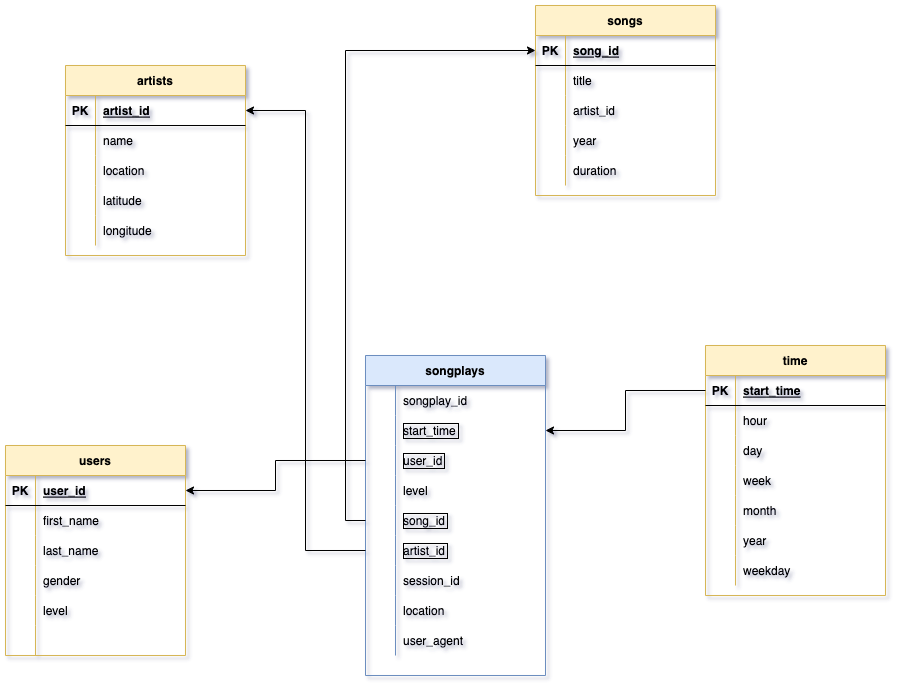

# Sparkify Data Modeling with Postgres

ETL pipeline and star schema data model built in Postgres for song play analysis, using Python and SQL.

---

## Overview

Designed and built a relational data model for a music streaming app (Sparkify) to enable song play analysis. The raw data lives in two sets of JSON files — song metadata and user activity logs — which are extracted, transformed, and loaded into a Postgres star schema optimized for analytical queries.

---

## Tech Stack

- **Database:** PostgreSQL
- **Language:** Python, SQL
- **Schema Pattern:** Star Schema (fact + dimension tables)
- **Data Format:** JSON logs (song data + event logs)

---

## Schema Design

Star schema optimized for queries on song play analysis.



### Fact Table

- **songplays** — records of song play events from the activity logs, linked to songs, artists, users, and time

### Dimension Tables

- **users** — app users (user_id, name, gender, subscription level)
- **songs** — songs in the music catalog (song_id, title, artist, year, duration)
- **artists** — artists in the music catalog (artist_id, name, location, coordinates)
- **time** — timestamps of song play events broken down into hour, day, week, month, year, weekday

---

## ETL Pipeline

The pipeline reads raw JSON files from two local directories and loads them into the star schema:

1. **Song data** (`song_data/`) — JSON files containing song and artist metadata, loaded into `songs` and `artists` dimension tables
2. **Log data** (`log_data/`) — JSON event logs of user activity, filtered to `NextSong` events and loaded into `songplays`, `users`, and `time` tables

---

## Key Design Decisions

- Chose a **star schema over a normalized model** because the analytics use case is read-heavy — denormalized dimension tables make song play queries faster and simpler to write
- The `time` table pre-breaks timestamps into components (hour, day, weekday, etc.) so analysts don't need to extract these on every query
- Used `INSERT ... ON CONFLICT DO NOTHING` for users to handle duplicate user records in the log data without failing the pipeline

---

## How to Run

1. Install dependencies: `pip install psycopg2`
2. Create and reset tables:
```
python create_tables.py
```
3. Run the ETL pipeline:
```
python etl.py
```
4. Verify results by running `test.ipynb`

---

## Repository Structure

```
├── create_tables.py      # Drops and recreates all tables
├── etl.py                # Full ETL pipeline (all files)
├── etl.ipynb             # Step-by-step ETL development notebook
├── sql_queries.py        # All SQL CREATE, INSERT, and SELECT statements
├── test.ipynb            # Validation queries to check table contents
├── start_schema.png      # Star schema diagram
└── data/
    ├── song_data/        # JSON song and artist metadata
    └── log_data/         # JSON user activity event logs
```
